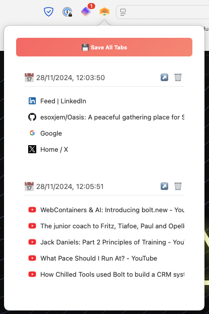

# Too many tabs?

  

A peaceful gathering place for your Safari tabs.

### 🎯 How to Use
1. Click the Oasis icon in your Safari toolbar
2. Hit "Save All Tabs" to store your current tabs
3. Your tabs are now stored in the browser's local storage
4. Restore tabs with a single click

Bring tranquility to your browsing experience with Oasis ✨

  

